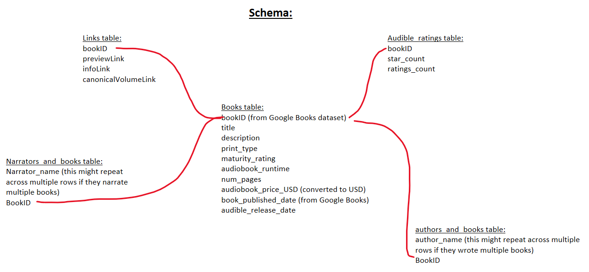

# Books-Data-Engineering
A complete ETL (extract, transform, load) process, cleaning up and combining a messy dataset of books on Audible, with data from the Google Books API.

## Schema of my final database:
